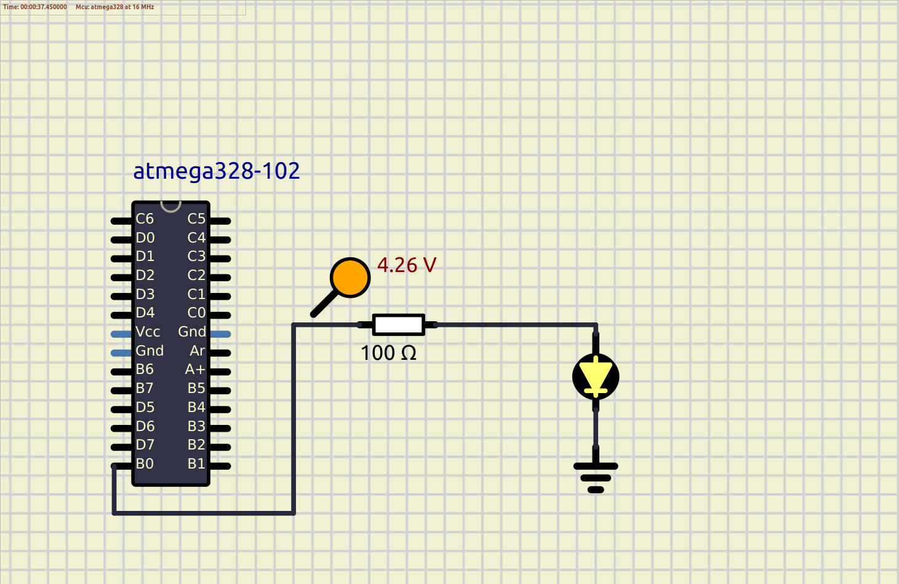
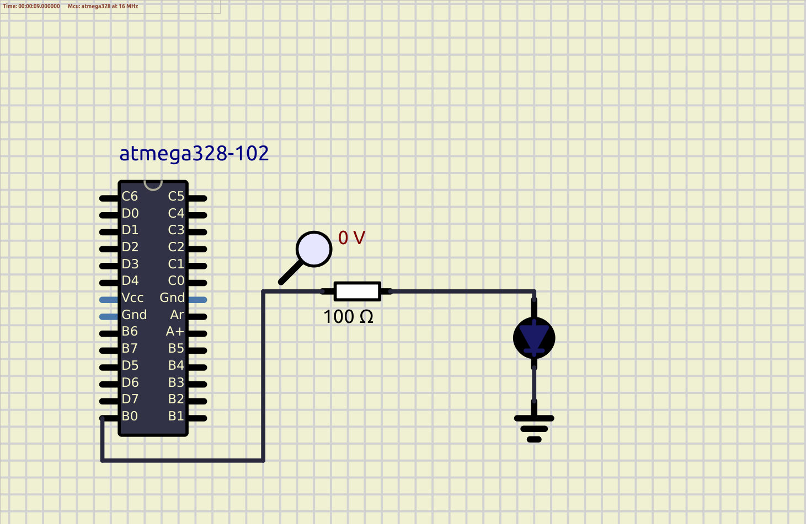

# Embedded C Programming Examples with Continuous Integration and Code Quality

# LED Blinking 

## In Action

|ON|OFF|
|:--:|:--:|
|||

#### CI and Code Quality

|Build|Cppcheck|Codacy|
|:--:|:--:|:--:|
||||

## Communication Protocols
* Wired
    * Parallel
    * Serial
        * UART  - TX & RX (2 devices)
            * 2 Wire
            * Individual clocks used by the both parties
            * Standard speed (9600, 115200) - Baud rate
            * Parity
        * SPI - Serial Programming Interface (Master and Slave)
            * 3 + 1 wire
                * Master In Slave Out
                * Master out Slave In
                * Clock
                * Optional Chip select - Individual Chip select
            * Max - Number GPIO's availabel CS pins
            * Frequency - 1/3 of Operating 
        * I2C - Inter IC  (Master & Slave), External Pull up resistors
            * 2 wired
                * Serial Data
                * Serial Clock
            * 7/9 bit Address for each entity
            * Start - Data line going low, clock low
            * Stop - Dataline going high, clock low
            * 7 bit address + 1 bit of acknowledge
            * 100k, 400K, 1.2M

        * Frequency
        * Data throughput
        * Number of pins
        * Type of devices which needs to talk
        * Error detection (UART & I2C)

* SDIO - uSD
* HDMI
* Ethernet

* Wireless
    * Bluetooth
    * Wifi
    * LORA
    * RFID

## Wiki Documentation
* System [SETUP](https://github.com/Bharathgopal/Emb-C/wiki)
